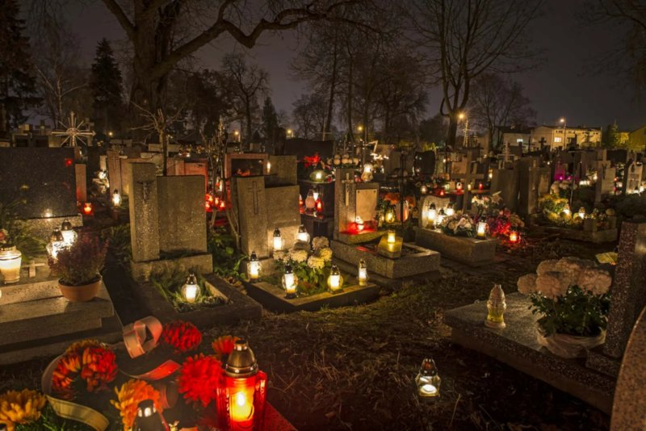

# All Saint's Day

In 731, Pope Gregory III [instituted "All Saints' Day"](https://www.britannica.com/topic/All-Saints-Day) on the 1st of November in a chapel in St. Peter's Basilica, to commemorate all the saints of the church who have attained heaven. This contributed to the [widespread adoption of November 1st for the celebration](https://www.christianity.com/church/church-history/all-saints-day-november-1.html).

## Halloween

 The evening prior to All Saint's Day (31 October) was called "All Hallows' Eve" which is known today as ***"Halloween"***. Some say it is coincidence, but it was also the date of [the pagan Celtic festival of Samhain](/content/kingdom/church/history/all-saints/kingdom/church/history/article.md.md). 
 
 The Celtics believed that on Samhain, the veil between the world of the living and the world of the dead became thin, and that ghosts and spirits could freely roam the earth. To celebrate Samhain, the Celts would build bonfires, wear costumes, and make offerings to the dead. They also believed that it was important to protect themselves from evil spirits, so they would often wear masks and carry torches. 
 
 Likewise, Pope Gregory III also wanted to honour the dead saints with "All Saints' Day". The resemblance is striking.

