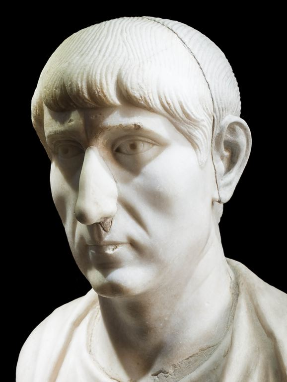

# The spread of Arianism

## Constantius II

In 337 [Constantius II](https://en.wikipedia.org/wiki/Constantius_II), the third son of [Constantine](#constantine) became emperor over Greece, Thrace, the Asian provinces, and Egypt in the east, while his brothers reigned the other parts of the Roman Empire. 

Constantius actively promoted [Arianism](/content/kingdom/church/history/1st-nicaea-creed.md) and convened councils (e.g., [Sirmium in 347-375](https://en.wikipedia.org/wiki/Councils_of_Sirmium), Constantinople in 360) to enforce compromise creeds [in favour of Arianism](https://www.britannica.com/topic/Arianism). He [banned pagan sacrifices and closed temples](https://en.wikipedia.org/wiki/Constantius_II) but tolerated some pagan institutions (e.g., Vestal Virgins).

Constantius also enforced [laws that restricted Jewish slave ownership and interfaith marriages](https://en.wikipedia.org/wiki/Constantius_II), likely to favour state businesses over Jewish competitors.   

## Bishop Ulfilas

Ulfilas, a Goth raised in a Cappadocian Christian family, was [consecrated as an Arian bishop by Eusebius of Nicomedia in 341](https://www.ebsco.com/research-starters/biography/ulfilas). He [translated the Bible into Gothic](https://paganheim.com/blogs/culture-religion/the-rise-and-spread-of-arian-christianity-among-the-goths), creating an alphabet.

Constantius policies made it possible for [Ulfilas to spread Arianism among the Goths](https://www.encyclopedia.com/people/philosophy-and-religion/roman-catholic-and-orthodox-churches-general-biographies/ulfilas) (Visigoths and Ostrogoths), distinguishing them from Nicene Christians in the Roman Empire.
