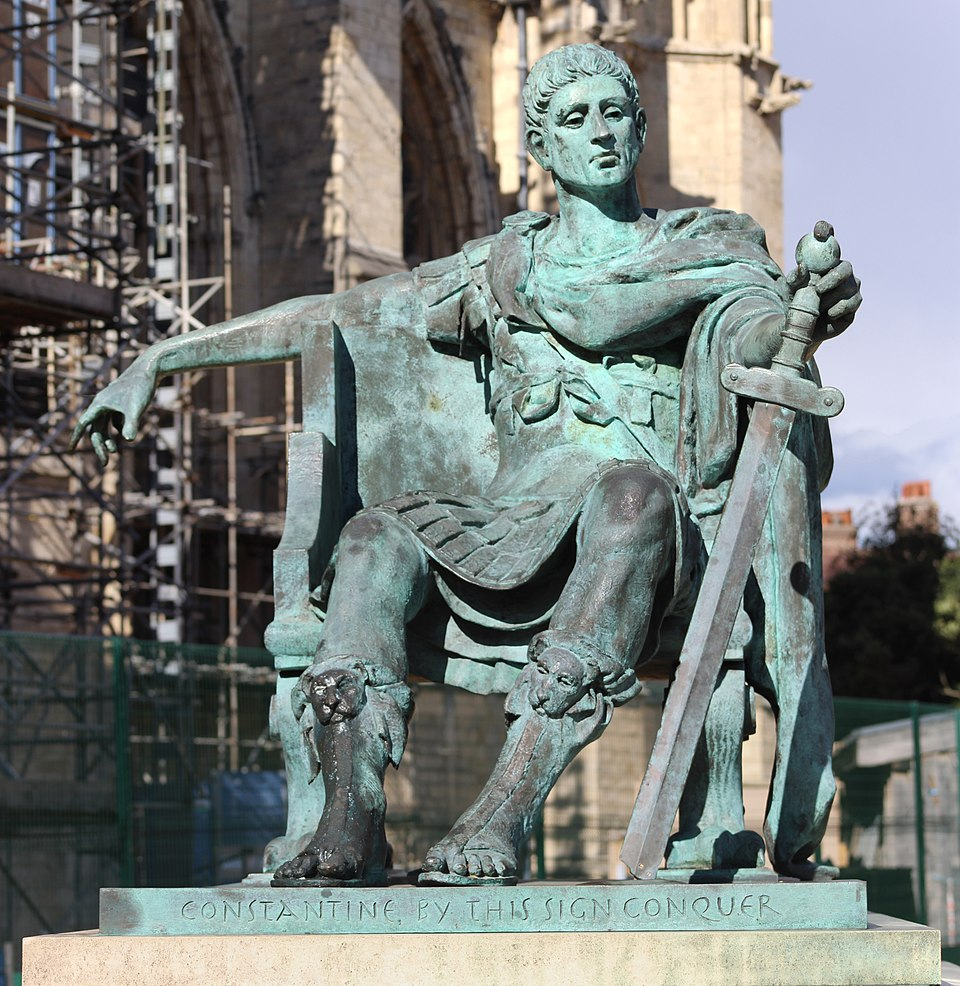
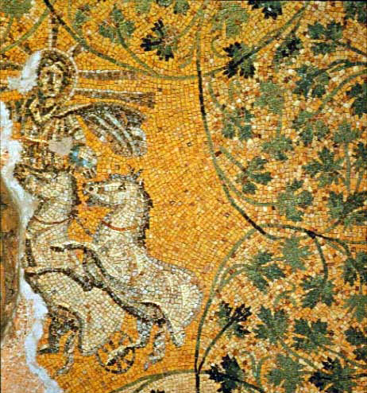
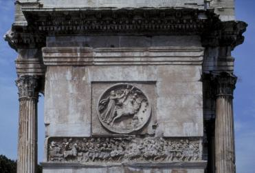
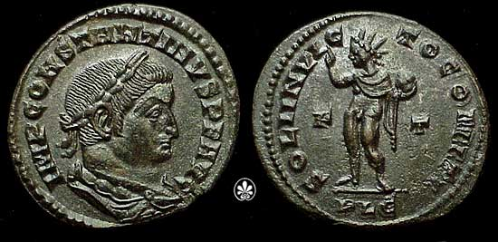
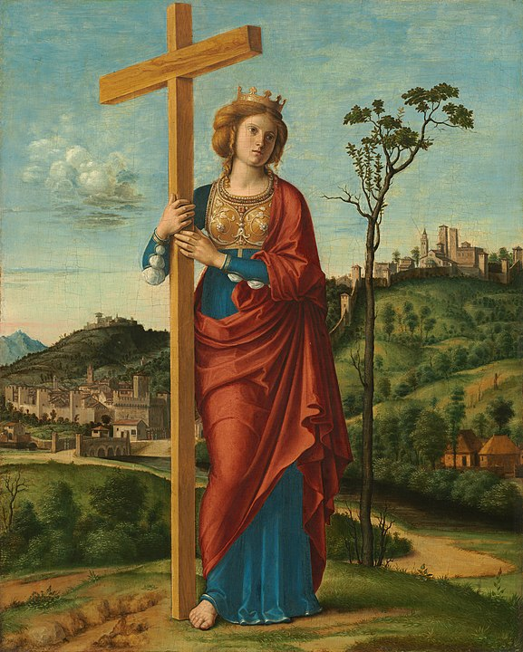

# Constantine

Due to military power, and a series of successful victories against his rivals, Constantine, became the emperor in 306 AD, the start of [the Constantinian dynasty](https://en.wikipedia.org/wiki/Constantinian_dynasty). In 312 AD at [the Battle of the Milvian Bridge Constantine secured his control over the western Roman Empire](https://en.wikipedia.org/wiki/Constantine_the_Great).

[Constantine could not legitimise his ruling as emperor based on his bloodlines.](https://www.thecollector.com/constantine-great-conversion-christianity) He also noticed that his predecessors like Diocletian, failed to have their legitimacies unchallenged despite the fact that [Diocletian styled himself as a godlike emperor](https://www.thecollector.com/constantine-great-conversion-christianity).

## Legitimisation of Christianity

> Constantine seems to have sought to establish his legitimacy through monotheistic means. Elagabalus, Claudius II, and Aurelian had all toyed with the idea of Sol Invictus as their ‘one god’ and Constantine also had close familial connections and sympathies to this cult.
>
> It was also apparent that, as one of the most powerful men in the Empire, Constantine would be approached by all sects attempting to seduce him for their cause. He remained open-minded, keeping an open and fluid court. Traditional Roman polytheists must have attempted to lure him toward Apollo, though he would have known that continuing with the traditional pantheon would leave him open to assaults on his legitimacy. Sol seemed promising, though had already been tried and failed on three occasions. Sol was also already very popular among the Roman elite and so could be used as a divine patron for another powerful Roman seeking to claim the imperial throne.
>
> The Christian sect remained relatively small, though not insignificant, had an empire-wide following, though not among his fellow elites, and preached peace and pacifism. As a doctrine, it would serve him well by revolutionizing Roman religion, allowing him to reconstruct society as a new founder of Rome, rewarding loyal converts to his doctrine and identifying potential pagan rivals more easily. Also, it would allow him to pacify a martial and restless population, directing their energies toward worship instead of war. All of these were reasons to favor the Christians, but most importantly, it was a monotheistic creed, placing all the powers of one God behind Constantine’s rule. To a deeply religious populace, this would make his sovereignty unquestionable.
>
> -- [Cameron Hughes, MA Field Archaeology, MA Politics](https://www.thecollector.com/constantine-great-conversion-christianity)

[In February 313, the Edict of Milan](https://www.britannica.com/topic/Edict-of-Milan) proclamation was issued by the Roman Emperors Constantine and Licinius. The proclamation:
* granted religious toleration to all religions, including Christianity throughout the Roman Empire;
* seized Christian persecutions of [the Great Persecution under Diocletian](https://courses.lumenlearning.com/suny-fmcc-worldhistory/chapter/the-rise-of-christianity/);
* recognised Christianity as a legitimate religion which allowed Christians to openly worship and practice their faith;

This allowed Christians to hold public offices, which were previously been denied to them.

[Constantine elevated bishops to positions of political influence](https://www.britannica.com/topic/Christianity/The-alliance-between-church-and-empire), appointing them and convening councils like [Nicaea](/content/kingdom/church/history/1st-nicaea-creed.md) to resolve theological disputes.

## Merging Jesus with Sol Invictus

> As well as Apollo, Sol Invictus, the Unconquered Sun, was associated with Constantinian propaganda. Constantine had adopted Sol as a personal deity by the latest 305 CE and continued to mint coins bearing the Sun deity until 319 CE, seven years after his victory at the Milvian Bridge. Sol had been used in attempts by Claudius II and Aurelian to move the Empire towards a monotheistic god behind a single emperor as a political expedient to prevent continual usurpation and civil war. It seems that Constantine had initially proceeded in their footsteps but had, at some point, decided to merge the Unconquered Sun with Jesus Christ as his patron deity.
>
> Both the sabbath, Sunday (day of the sun), and [Christmas day](/content/kingdom/church/history/1st-nicaea-creed.md#the-first-christmas) derive from practices and observances in the cult of Sol Invictus. The cult of the Sun God also promoted absolving sins, rebirth, abstinence, resurrection, monotheism, and a form of baptism. Constantine recounted to Eusebius (1.29) his vision of the Cross appearing in the light of the sun with the instruction ‘In Hoc Signo Vinces’, by this sign conquer. Other reports claim different visions, and it is likely that Eusebius, a Christian, had convinced Constantine that this was a sign from the Christian God. The solar signal is also reported to have presented the Greek letters Chi and Rho to Constantine, the first two letters of Christos, and therefore another sign of the Christian God. Though the Chi-Rho has also been associated with Kronos, Saturn, a disciple of Sol.
>
> -- [Cameron Hughes, MA Field Archaeology, MA Politics](https://www.thecollector.com/constantine-great-conversion-christianity)

Similarities between Sol Invictus and Jesus Christ:

| Sol Invictus                           | Jesus Christ                                                     |
| -------------------------------------- | ---------------------------------------------------------------- |
| Calls himself the ["Unconquered Sun"](https://bigthink.com/the-past/sol-invictus/) | Calls himself "[the light](/content/kingdom/bible/metephors/light.md)" |
| [The birthday was celebrated on 25 December (Dies Natalis Solis Invicti)](https://mythology.net/roman/roman-gods/sol-invictus/) | The birthday is still celebrated on 25 December by Christians |
| [The birthday mark the winter solstice and the sun's "rebirth" after its darkest period](https://www.academia.edu/126448683/Sol_Invictus_The_Unconquered_Sun_and_the_Light_of_Eternity) | Some Christians belief Jesus was ["rebirth" from God into a human form](/content/kingdom/god/son/essence/as-god/incarnation.md) |
| [Considered a "protector" by Roman soldiers](https://roman-empire.net/religion/sol/) | Considered a [saviour](/content/kingdom/god/son/essence/as-god/saviour.md) by Christians |

> "... it appeared an unworthy thing that in the celebration of this most holy feast we should follow the practice of the Jews, who have impiously defiled their hands with enormous sin, and are, therefore, deservedly afflicted with blindness of soul ... Let us then have nothing in common with the detestable Jewish crowd; for we have received from our Saviour a different way."

Constantine's true intent and dedication to Christianity is questionable:

### Pagan examples

* Constantine constructed a triumphal arch at Rome with the inscription on ‘[The Arch of Constantine](https://en.wikipedia.org/wiki/Arch_of_Constantine)’ and fails to mention Christianity, but instead attributes the victory after the Milvian Bridge battle to [an unnamed ‘divine power’ and ‘the greatness of Constantine’s mind’](https://www.wondriumdaily.com/constantine-i-contributions-to-christianity-and-other-accomplishments/). 

* [Statuettes of Sol Invictus](https://en.wikipedia.org/wiki/Sol_Invictus), carried by the standard-bearers, also appear in three places in reliefs on the Arch of Constantine.

* The Arch of Constantine was carefully positioned to [align with the colossal statue of Sol Invictus](https://en.wikipedia.org/wiki/Sol_Invictus) by the Colosseum, so that Sol formed the dominant backdrop when seen from the direction of the main approach towards the arch.

* Constantine's official [coinage continues to bear images of Sol Invictus](https://en.wikipedia.org/wiki/Sol_Invictus) until 325.

* On 7 March 321, [Constantine decreed "DIES SOLIS"](https://sabbathsentinel.org/2016/10/13/constantine-march-321-ad/) which means "the day of the Sun", known today as "Sunday" – as the Roman day of rest: "On the venerable day of the Sun let the magistrates and people residing in cities rest, and let all workshops be closed."

[This why our weekdays are named](https://en.wikipedia.org/wiki/Names_of_the_days_of_the_week):

| English   | Latin         | Name of god                                           |
| --------- | ------------- | ----------------------------------------------------- |
| Sunday    | dies Solis    | **Sol Invictus**                                      |
| Monday    | dies Lunae    | Moon god                                              |
| Tuesday   | dies Martis   | Mars, the Roman god of war                            |
| Wednesday | dies Mercurii | Woden, the Germanic god / Mercury, the Roman god      |
| Thursday  | dies Jovis    | Thor, the Germanic god of thunder                     |
| Friday    | dies Veneris  | Frigg, the Germanic goddess / Venus the Roman goddess |
| Saturday  | dies Saturn   | Saturn, the Roman god                                 |

### Resistance against the merge

[Around 321 AD, Arius, a presbyter in Alexandria was excommunicated by his bishop](https://www.johnsanidopoulos.com/2019/05/saint-alexander-patriarch-of-alexandria.html), Alexander because Arius taught that [Christ was the Son of God](/content/kingdom/god/son/essence/of-god.md) and [not of the same substance as God the Father](/content/kingdom/god/son/essence.md). This teaching clashed with the [Trinity doctrine](/content/kingdom/bible/doctrines/trinitarian.md) which taught that the Son and the Father are equal and the same.

## Anti-Judaic legislation

Jews living in the Roman Empire were legally obliged to pay the [Fiscus Judaicus](https://en.wikipedia.org/wiki/Fiscus_Judaicus) tax since the destruction of the Jewish Temple in 70 CE. [This tax continued during Constantine's reign.](https://en.wikipedia.org/wiki/Constantine_the_Great_and_Judaism)

> It was noted that Judaism was “an abominable sect”. -- [Fordham University website, “Jews and the Later Roman Law 315-531 CE”](https://sourcebooks.fordham.edu/jewish/jews-romanlaw.asp)

> He also began to claim land in Syria Palaestina for use by the Christian Church. During a visit by his mother in 326 to 327, she identified places where key events may have taken place in Jesus’ life; Constantine went on [build churches](#constantines-churches) at those locations. -- [Messianic Bible](https://free.messianicbible.com/feature/constantine-foundations-of-anti-semitism/)

## The discovery of the cross

[Constantine's mother was Helena, a staunch Christian and one of the first pilgrims,](https://www.thecollector.com/who-was-constantine-the-great-and-accomplishments/) has likely also influenced Constantine's decision to favour Christianity. [Legends say that Helena ordered to torn down a pagan temple that was built upon the site of Calvary](https://en.wikipedia.org/wiki/Helena,_mother_of_Constantine_I) and that the excavations led to the discovery of [the true cross](https://en.wikipedia.org/wiki/True_Cross) which became a [symbol](/content/kingdom/bible/symbolism/cross.md) that is still visible in modern Christian churches.

## Church buildings

Before Constantine's reign there was not much that distinguished the Christian church buildings from typical domestic architecture.

### The first church

The [first known Christian church was build around 293 to 303 AD at Jordan (Aqaba)](https://www.guinnessworldrecords.com/world-records/first-purpose-built-church/). The walls were about 4.5m high and would have contained initially 60 people.

The exact reason why this church was originally built is unknown.

> "The earliest Christians worshipped in private homes because Christianity became an illegal religion and was actively persecuted by the Roman government... The anti-Christian laws were still on the books but not enforced." -- [Dr. S. Thomas Parker, professor of history at North Carolina State University](https://www.newswise.com/articles/case-for-oldest-purpose-built-christian-church-bolstered)

The original structure was [abandoned and demolished in 303 AD during the Diocletianic Persecution](https://www.wondermondo.com/aqaba-church/), but was [rebuilt around 313-330 AD](https://www.guinnessworldrecords.com/world-records/first-purpose-built-church/).

This church was finally [destroyed by an earthquake in 363 AD](https://www.guinnessworldrecords.com/world-records/first-purpose-built-church).

### Constantine's churches

In 324 at the Battle of Chrysopolis, Emperor Constantine became the sole ruler of the entire Roman Empire.  This established Christianity as the dominant force of the Roman Empire.

[In 330 Constantinople (today Istanbul) became the capital of the Roman Empire](https://en.wikipedia.org/wiki/Constantinople) which is generally considered the centre and the "cradle of Orthodox Christian civilisation".

[During Constantine's reign he funded many new church building projects](https://en.wikipedia.org/wiki/Constantine_the_Great_and_Christianity#Church_construction) like:

* Church of the Holy Sepulchre in Jerusalem, built on the site believed to be Jesus Christ's tomb.
* Church of the Nativity in Bethlehem, marking the birthplace of Jesus.
* Church of the Holy Apostles in Constantinople, intended as Constantine's mausoleum.
* Church of Hagia Irene in Constantinople, commemorating his victory at the Battle of Chrysopolis.
* Old St. Peter's Basilica in Rome, constructed on the Vatican Hill over the tomb of St. Peter.

Even after his reign Christians continued to build very large, expensive and spectacular church buildings. Possible reasons for this is:

* Roman emperors were used to build big spectacular temples for their gods
* Church buildings were considered ["sacred architecture"](https://www.americamagazine.org/faith/2019/03/04/why-we-need-design-and-pay-beautiful-churches) which is supposed to honour God (or rather the Bishop).
* According to [Michael Fackerell](https://christian-faith.com/why-christians-love-to-spend-so-much-money-on-church-buildings/), people build expensive church buildings:
  * For **marketing purposes** to attract more members.
  * It is a church's **identity (brand)**.
  * To generate more **money**: Bigger churches can serve more members to receive more donations.
  * **Investment** purposes for generations to come, because often real estate grows in value.
  * For the **convenience** of the members: for example air-conditioners, comfortable seats, sound equipment, etc.
  * For the **safety** to secure the continual existence of the church.
  * Usually churches are build in central places to **avoid people to scatter** to other places or churches (like the tower of Babel).
  * Some believe that good pastors or preacher deserve a **big public platform** so that more people could have access to their sermons.
  * Church buildings are **monuments** to the leadership who raised the funds to complete the project.
