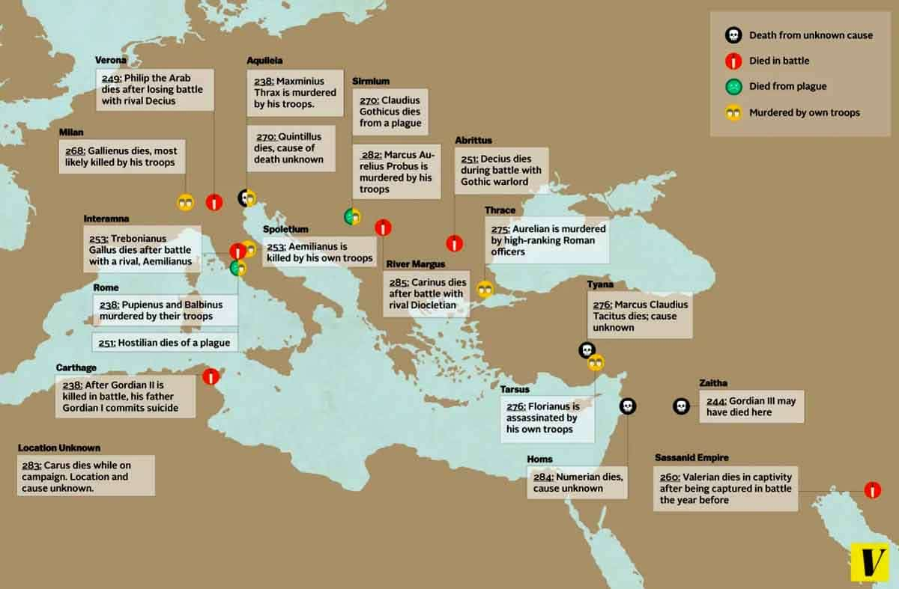

# The Crisis of the Third Century

[The Crisis of the Third Century](https://worldhistoryedu.com/crisis-of-the-thrid-century/) started in 235 where there were political instability and division in the Roman Empire. During this period, [26 emperors ruled](https://courses.lumenlearning.com/atd-herkimer-westerncivilization/chapter/crises-of-the-roman-empire/), by which many of them were quickly removed from their thrones after only a few months. 

By this time emperors were no longer claiming to be divine. However, it was still common for emperors to be associated with divine authority, but this was not based on their bloodlines.

On 25 December AD 274, the Roman [emperor Aurelian](https://en.wikipedia.org/wiki/Aurelian) established the cult of [Sol Invictus](https://en.wikipedia.org/wiki/Sol_Invictus) ("Unconquered Sun") as an official religion, alongside the traditional Roman cults.

The Crisis of the Third Century only [ended when Diocletian became emperor](https://www.thecollector.com/what-was-the-crisis-of-the-third-century/) in 284 Diocletian stabilized the empire with co-emperor and clear lines of succession and governance. 
