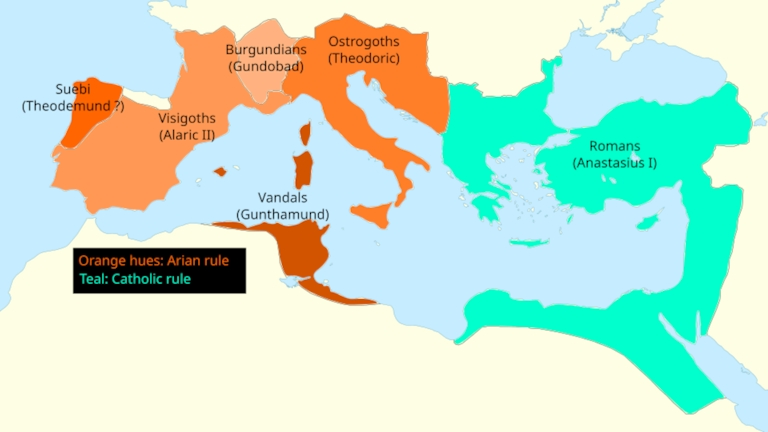

# The Dark Ages

## The split of the Roman Empire

In 395 CE the [Roman Empire split in two separates states](https://study.com/academy/lesson/the-division-of-rome-into-eastern-and-western-empires.html) after the death of the Roman emperor Theodosius I, who was succeeded by his two sons Honorius (the Western Roman Empire) and Arcadius (the Eastern Roman Empire).

## The fall of the Western Roman Empire

In 476 CE [the Western Roman Empire fall](https://en.wikipedia.org/wiki/Deposition_of_Romulus_Augustus) to Odovacar, the Germanic ("Barbarian") King. This event traditionally mark [the end of the Western Roman Empire](https://dlab.epfl.ch/wikispeedia/wpcd/wp/r/Romulus_Augustus.htm), because Odavacar sent the western imperial regalia (crown, scepter, orb, etc.) to Constantinople, the capital of the rival Eastern Roman Empire (Byzantine Empire) as an acknowledgement to the supremacy of the Eastern Emperor.

Following the fall of the Western Roman Empire, its territories fragmented into various Germanic kingdoms and other successor states, such as the Ostrogothic Kingdom in Italy and the Visigothic Kingdom in Spain.

## The fall of the Arian nations

In 507, the [Visigothic](https://en.wikipedia.org/wiki/Visigoths), was defeated by the Franks under Clovis I, who defeated them in the Battle of Vouillé.

In 534, the [Vandals](https://en.wikipedia.org/wiki/Arianism), an Arian Germanic tribe, were militarily defeated by the Byzantine Empire during the Vandalic War. Their remnants were dispersed, and they ceased to function as a cohesive Arian nation.

In 553, the [Ostrogoths](https://en.wikipedia.org/wiki/Ostrogoths), were defeated by the Byzantine Empire.

In 653, the [Lombards](https://en.wikipedia.org/wiki/Arianism) adopted the Nice orthodoxy under King Aripert I.

Thus, no Arian nations survived as distinct political entities, but [Arianism persisted among certain Germanic groups](https://en.wikipedia.org/wiki/Arianism).

