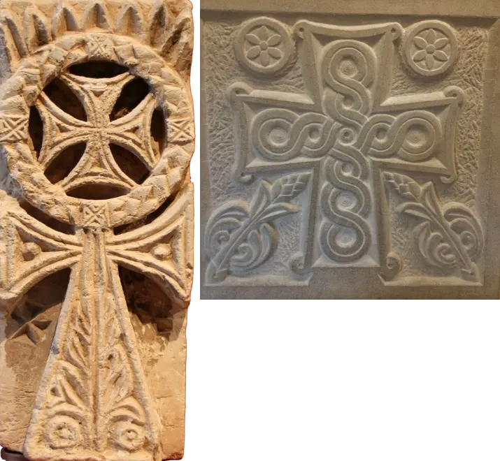

# The Gnostics

Acts 8:9-24 possibly refers to [Simon Magus](https://en.wikipedia.org/wiki/Simon_Magus) as a Gnostic teacher. Whether he originated [Gnosticism](https://en.wikipedia.org/wiki/Gnosticism) is debatable, however from this we can see the Gnosticism was already active when [the first Christian gatherings](/content/kingdom/church/history/christian.md) was formed.

Like [Christianity](/content/kingdom/church/history/christian.md), Gnosis also originates from the Middle East.

In short gnostic philosophers reason:

* There is a good spiritual world and an evil or flawed material world
* Living beings are emanations (smaller material manifestation) of the same God
* Human souls are fallen sparks of divine (emanations), trapped in the material world created by the evil demiurge (the God of the Old Testament)

The original christian church rejected these philosophies as "heresy".

However, some of Gnostic ideas could have potentially influenced Christianity, for example:

| Gnosticism                                                                     | Christianity                                                                        |
|--------------------------------------------------------------------------------|-------------------------------------------------------------------------------------|
| There are many aeons within one God.                                           | There are three members within one [godhead](/content/kingdom/bible/concepts/godhead.md).              |
| Aeons are emanations of one God.                                               | Members of the godhead are of the same substance of one God.                        |
| Jesus is an Aeon, an emanation of God.                                         | [Jesus](/content/kingdom/god/son.md) is a member of the godhead.                                       |
| God resides in the Pleroma.                                                    | God resides in the [Heaven](/content/kingdom/bible/concepts/heaven.md).                                |
| The highest aeons may act as a mediators to God.                               | [The exalted Son (Jesus)](/content/kingdom/god/son/essence/as-god/lord.md), acts as a mediator to God. |
| Only the mediator can bridge the gap between the material and spiritual world. | [We need to pray through Jesus](/content/kingdom/life/prayer.md), our mediator, to God.                |
| Jesus was sent from the Pleroma to aid humanity.                               | Jesus was sent [from Heaven](/content/kingdom/bible/idioms.md) to aid humanity.                        | 
| Jesus appeared as a human, but was still an Aeon.                              | [Jesus appeared as a human](/content/kingdom/god/son/essence.md), but was 100% God at the same time.   |
| You need to have enough gnosis (secret knowledge) for salvation.               | Your need to have enough [faith](/content/kingdom/life/faith.md) for [salvation](/content/kingdom/eternal/saved.md).      |
| The Gnostic cross symbol                                                       | [The Christian cross symbol.](/content/kingdom/bible/symbolism/cross.md)                               |

*Note that not all gnostics and christians share the same views. This table only highlights where these religions could have influenced each other's views.*

*Gnostic cross on the left compared with the Byzantine Christian cross on the right*