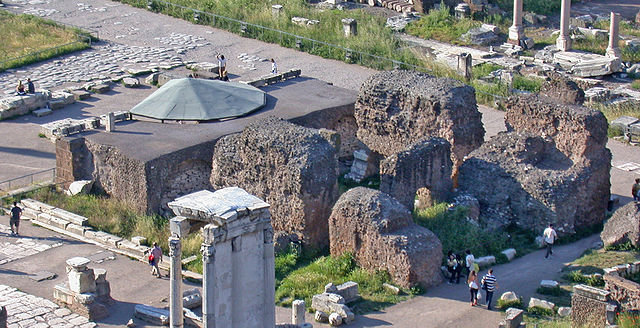

# The Roman Imperial Cult

The early Roman Empire used to deify their rulers as gods.

> The first Roman to become a god, as part of aiming at monarchy, was Julius Caesar.
>
> ...
>
> In 29 BC Octavian dedicated [the temple of the divus Julius](https://en.wikipedia.org/wiki/Temple_of_Caesar) at the site of Caesar's cremation. Not only had he dutifully, legally and officially honoured his adoptive father as a divus of the Roman state. He "had come into being" through the **Julian** star and was therefore the divi filius (son of the divinity). But where Caesar had failed, Octavian had succeeded: he had restored the pax deorum (lit. peace of the gods) and re-founded Rome through "August augury". In 27 BC he was voted – and accepted – the elevated title of **Augustus**.
>
> -- [Wikipedia](https://en.wikipedia.org/wiki/Roman_imperial_cult)

This established an imperial cult with a close association between political power and religion authority. Not surprisingly, the Romans named the months after these gods in [the Roman Calendar](https://en.wikipedia.org/wiki/Roman_calendar) which was later converted to [the Julian Calendar](https://en.wikipedia.org/wiki/Julian_calendar) (Julius Caesar's Calendar):

| English   | Name of god                                                                                                                           |
|-----------|---------------------------------------------------------------------------------------------------------------------------------------|
| January   | [Janus](https://en.wikipedia.org/wiki/Janus_(god)), the Roman god of beginnings and endings                                           |
| February  | [Februus](https://simple.wikipedia.org/wiki/Februus), the Roman god of purification of the underworld                                 |
| March     | [Mars](https://en.wikipedia.org/wiki/Mars_(god)), the Roman god of war                                                                |
| April     | [Apru](https://en.wikipedia.org/wiki/Aphrodite), the Greek goddess of love, lust, beauty, pleasure, passion, procreation              |
| May       | [Maia](https://en.wikipedia.org/wiki/Maia), the Greek goddess who gave birth to other gods                                            |
| June      | [Juno](https://en.wikipedia.org/wiki/Juno_(mythology)), the Roman goddess of love                                                     |
| July      | **[Emperor Julius Caesar](https://en.wikipedia.org/wiki/Julius_Caesar)**, who "came into being" through the Julian star               |
| August    | **[Emperor Augustus](https://en.wikipedia.org/wiki/Augustus)**, the adopted son of Julius Caesar, but **considered the "son of god"** |
| September | Was the seventh month in the previous Roman calendar                                                                                  |
| October   | Was the eighth month in the previous Roman calendar                                                                                   |
| November  | Was the ninth month in the previous Roman calendar                                                                                    |
| December  | Was the tenth month in the previous Roman calendar                                                                                    |
*Fun fact: [Emperor Augustus ensured that his month must also have 31 days](https://en.wikipedia.org/wiki/Augustus) like his father's July.*

[In July 64 AD the Great Fire of Rome erupted](https://www.thecollector.com/great-fire-of-rome/). The fire raged for 6 days, devastating the capital and leaving most residents homeless. For various political reasons, Nero needed someone to blame.

The small minority [Christian](/content/kingdom/bible/concepts/christian.md) religion was considered a [threat to this existing Roman Imperial cult](https://www.thecollector.com/how-did-emperor-nero-treat-christians-during-his-reign/). Therefore, [Emperor Nero, blamed the Christians for the Great Fire and turned the Roman state into a violent prosecutor of Christians](https://www.thecollector.com/how-did-emperor-nero-treat-christians-during-his-reign/).

To make matters worse, [the first Jewish Revolt started in 66 AD](https://www.britannica.com/event/First-Jewish-Revolt) which caused the Romans to Siege and destroy Jerusalem including the Jewish temple in 70 CE. [These rebellions turned the Romans against any person who served a "Jewish" God](https://rsc.byu.edu/new-testament-history-culture-society/first-jewish-revolt-against-rome).

Ironically, these prosecutions affectively caused the Gospel to spread even faster through the Roman Empire.
